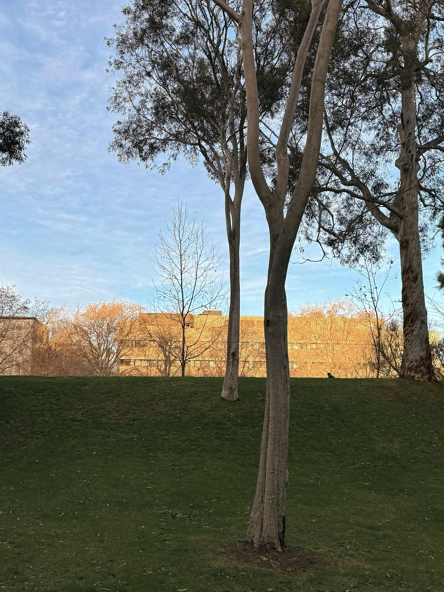
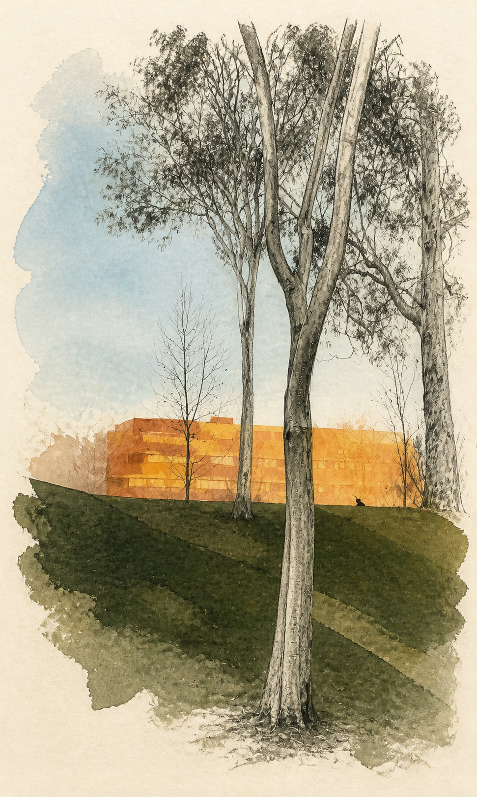
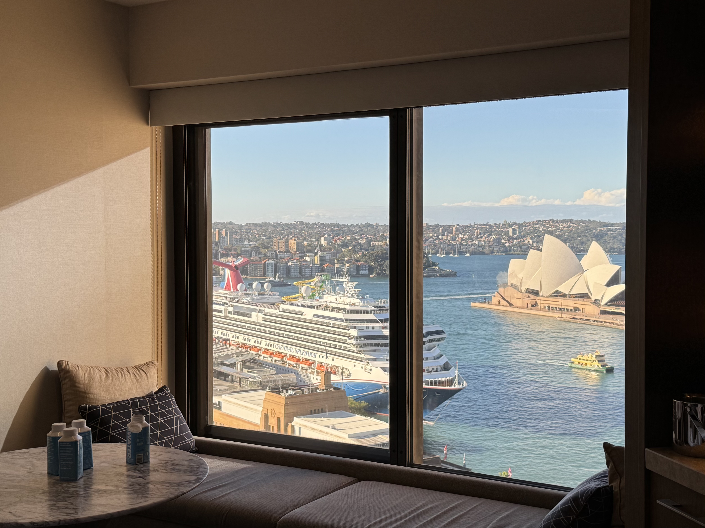
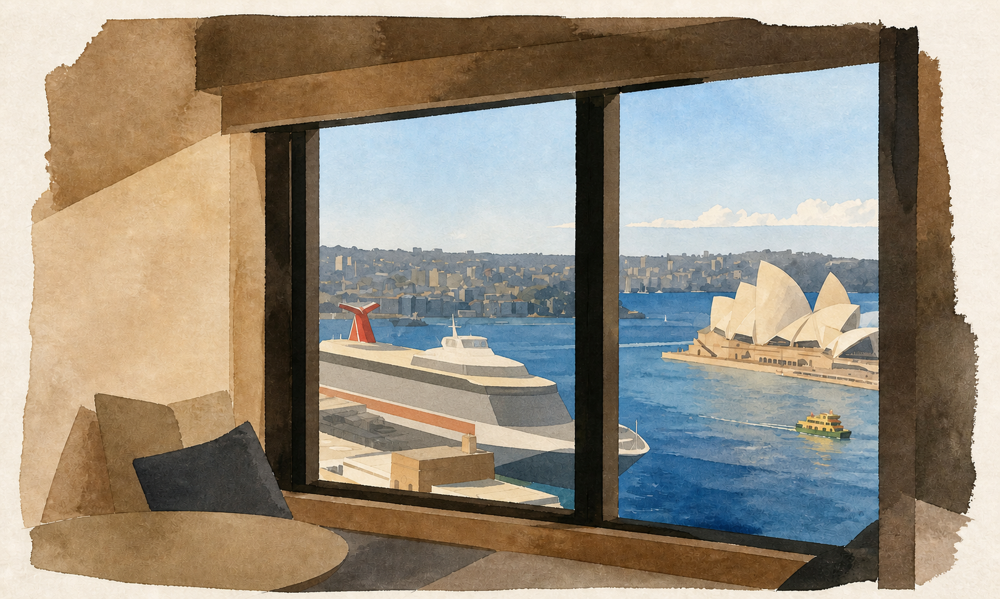
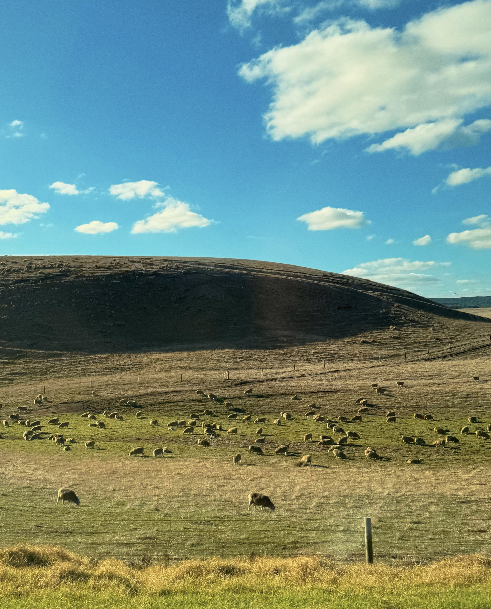
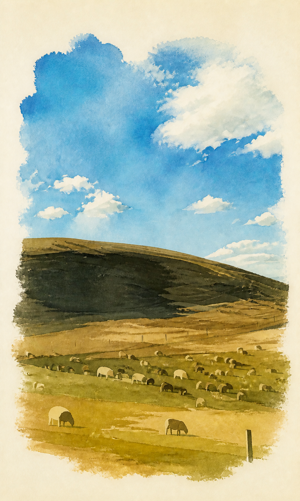

# Dreamwoven Reality

> **虚实交织影像**
> 一个用于将真实照片转化为「摄影 × 抽象」编辑式视觉作品的 Codex Skill。

Dreamwoven Reality 不是简单的滤镜、风格迁移或“一键插画化”工具。

它尝试解决的是另一个问题：

**如何在保留照片真实感、人物身份和场景结构的同时，让抽象语言真正进入画面，并与摄影形成有秩序的交织。**

项目通过场景分析、语义区域划分、抽象强度控制、人物完整性保护、视觉语言约束和最终质量检查，将普通照片转化为具有编辑设计感的海报式图像。

---
## 效果示例

### Botanical Unity

<table>
  <tr>
    <td align="center"><strong>原图</strong></td>
    <td align="center"><strong>处理后</strong></td>
  </tr>
  <tr>
    <td></td>
    <td></td>
  </tr>
</table>

### Huizhou Window Framing

<table>
  <tr>
    <td align="center"><strong>原图</strong></td>
    <td align="center"><strong>处理后</strong></td>
  </tr>
  <tr>
    <td></td>
    <td></td>
  </tr>
</table>

### Pastoral Living Cluster

<table>
  <tr>
    <td align="center"><strong>原图</strong></td>
    <td align="center"><strong>处理后</strong></td>
  </tr>
  <tr>
    <td></td>
    <td></td>
  </tr>
</table>

---

## 核心理念

这个 Skill 的核心不是“把照片画成某种风格”，而是：

> **Ordered Interweaving of Reality and Abstraction**
> 有秩序地交织真实与抽象。

照片中的不同区域不会被统一套上同一种效果。

系统会根据场景中的人物、建筑、道路、水体、山体、植被和其他视觉结构，分别决定：

* 哪些区域保留摄影信息
* 哪些区域进行抽象重构
* 真实与抽象的边界应该出现在哪里
* 哪些细节必须保留以维持场景识别
* 哪些视觉噪声应该主动删减

最终目标不是“半张照片 + 半张画”，而是让真实和抽象在同一个空间结构中自然进入、停止、重新出现。

---

## 主要能力

### 1. 基于语义的虚实交织

抽象区域不是随机生成。

系统会优先沿着真实场景中的结构边界进行转换，例如：

* 建筑立面
* 屋顶线
* 道路透视
* 山脊
* 海岸线
* 水面结构
* 阴影边界
* 遮挡关系

从而让抽象区域依然属于原始照片的空间逻辑。

---

### 2. 人物完整性保护

对于画面中的主要人物，默认采用：

**Fully Photographic**

即人物整体保持摄影状态，包括：

* 面部
* 发型
* 身体
* 衣服
* 手部
* 姿态
* 与环境发生接触的位置

不会把一个人物切割成“半真人、半插画”。

对于主要人物的脸部，还要求采用确定性的原图像素恢复，而不是依赖生成模型“重新画一个相似的人”。

---

### 3. Living Subject Integrity

所有具有生命属性的主体都会作为完整视觉单元处理，例如：

* 人
* 动物
* 鸟
* 树木
* 独立植物

每个主体只能选择：

* 完整摄影
* 完整抽象

而不会在同一个主体内部随意切换真实与抽象。

---

### 4. 多级抽象强度

Skill 提供三种主要抽象等级：

| 模式     | 推荐抽象覆盖 |
| ------ | -----: |
| Light  | 30–40% |
| Medium | 45–60% |
| Strong | 65–85% |

默认推荐使用 **Medium**。

抽象覆盖率指真正替代照片纹理和细节的区域，而不是简单的：

* 降饱和
* 模糊
* 加颗粒
* 加纸张纹理
* Posterize
* 全局滤镜

---

### 5. 场景级视觉设计

在进行图像处理前，Skill 会先分析：

* 场景类型
* 主体
* 建筑层级
* 身份敏感度
* 视觉重心
* 主色
* 负空间
* 建筑与自然区域
* 可抽象区域
* 应保留的识别特征

然后形成一个内部的 **Strategy Record**，再决定最终视觉方向。

因此同一种 Skill 面对：

* 人像
* 建筑
* 街景
* 自然风景
* 城市景观
* 群体照片

时会采用不同处理策略。

---

## 设计原则

### 真实不是背景，抽象也不是装饰

摄影区域和抽象区域应该具有相同的重要性。

抽象不应该只是：

> 在照片上画几条线。

摄影也不应该只是：

> 给一张插画留下几个照片碎片。

两者需要共同构成画面的结构。

---

### 少量、明确的大区域

优先使用少数几个清晰的视觉区域，而不是大量碎片化效果。

推荐：

* 3–6 个主要语义区域
* 一种主要抽象媒介
* 最多一种辅助媒介
* 克制的颜色系统

避免产生视觉噪声。

---

### 保留识别，重构细节

对于建筑和复杂物体：

保留：

* 位置
* 轮廓
* 透视
* 比例
* 标志性结构

可以简化：

* 重复窗户
* 栏杆
* 瓦片
* 砖缝
* 密集线条
* 非核心装饰

让画面的信息层级更加清晰。

---

## 工作流程

整体流程可以概括为：

```text
输入照片
   ↓
场景诊断
   ↓
识别人物 / 建筑 / 自然区域
   ↓
制定视觉策略
   ↓
确定抽象强度
   ↓
划分真实 / 抽象区域
   ↓
生成或编辑
   ↓
恢复身份敏感区域
   ↓
质量检查
   ↓
最终排版
```

---

## 使用方式

这个仓库主要作为一个 Codex Skill 使用。

将 Skill 安装到 Codex 的 Skills 目录后，即可在任务中调用：

```text
$dreamwoven-reality
```

例如：

```text
Use $dreamwoven-reality to transform this photo into an
ordered real/abstract editorial poster.
```

也可以直接描述你希望的抽象程度：

```text
Use $dreamwoven-reality.

Abstraction strength: medium.

Keep the main person completely photographic.
Transform the architecture and ground into a controlled mix of
photography, structural linework, and abstract color planes.
```

---

## 项目结构

```text
dreamwoven-reality/
│
├── SKILL.md
│
├── LICENSE
│
├── agents/
│   └── openai.yaml
│
├── references/
│   ├── visual-direction.md
│   └── exemplars.md
│
├── assets/
│   └── exemplars/
│
└── scripts/
    ├── inspect_photo.py
    └── compose_poster.py
```

### `SKILL.md`

整个 Skill 的核心。

包含：

* 工作流程
* Strategy Record
* 视觉规则
* 人物保护规则
* 抽象强度
* 场景处理逻辑
* Quality Gate

---

### `references/visual-direction.md`

视觉方向与设计规范。

用于进一步定义：

* 构图
* 色彩
* 抽象语言
* 摄影与抽象的关系
* 场景级设计原则

---

### `references/exemplars.md`

示例图像的使用规则。

示例主要作为：

* 视觉结构参考
* 抽象程度参考
* 质量标准参考

而不是固定的风格模板。

---

### `scripts/inspect_photo.py`

用于读取和检查照片信息，例如：

* 图像尺寸
* 元数据
* EXIF
* 拍摄时间

---

### `scripts/compose_poster.py`

用于最终海报合成。

支持多种输出方式，包括：

* `processed`（默认）
* `fullbleed`

默认成品为两段式渐进编辑拼贴：上方不是未经处理的原图，而是仍以摄影感为主的低至中度局部抽象；下方则进一步进入高强度、源图语义驱动的抽象重构。两部分共享构图、人物与地标身份、配色和材料语言，并由日期、主标题与副标题信息带建立固定层级。横图、竖图和近方图仍按源图方向自适应。

画布默认以原图尺寸和宽高比为构图基准。脚本会先读取 `original.width` 与 `original.height`，再按图片方向和各区段相对高度推导完整画布；不会先建立固定的 `1800×3000` 或 `3000×1800` 画布。

* 原图只作为尺寸、方向、取景逻辑与元数据基准；默认不会直接贴入顶部。
* 原图不得作为面板、缩略图、对照条、背景或可见碎片出现在默认成品中。
* `--upper-poster` 提供摄影感主导的部分抽象完整场景，`--poster` 提供更强的下部抽象。
* 两个生成阶段始终按原图比例缩放，默认使用完整取景优先的 `contain` 行为。
* `--width` 与 `--height` 仅作为可选导出边界，不会改变构图比例。
* `--export-long-edge` 是整张成品的等比长边上限，默认值为 `3000`；传入 `0` 可关闭该上限。
* 禁止独立缩放 x/y 轴，也不会将竖图压成浅横条。

---

## 适合的场景

这个 Skill 特别适合：

* 城市摄影
* 建筑摄影
* 旅行照片
* 街头摄影
* 风景摄影
* 人物 + 建筑场景
* Editorial Poster
* Photo Collage
* 摄影 × 插画
* 摄影 × 线稿
* 摄影 × 平面设计

---

## 不是什么

这个项目并不是：

* Lightroom Preset
* Instagram Filter
* 单纯 Prompt Collection
* 一键 Anime Filter
* 普通 Style Transfer

更准确地说，它是一套：

**面向生成式图像编辑的视觉设计规则系统。**

或者可以理解为：

> **一个将艺术指导、场景理解和图像编辑规则封装到 Codex Skill 中的视觉工作流。**

---

## License

本项目仅供**个人、非商业用途**使用。

如果你：

* 使用本 Skill
* 修改本 Skill
* 发布基于本 Skill 制作的作品
* 分享其衍生版本

请注明作者：

**LeoLittleLeo**

并链接回原始 GitHub 仓库。

商业用途目前不被允许。

完整条款请参阅：

`LICENSE`

---

## Author

**LeoLittleLeo**

Dreamwoven Reality / 梦织现实

> Reality remains visible.
> Abstraction becomes structural.
